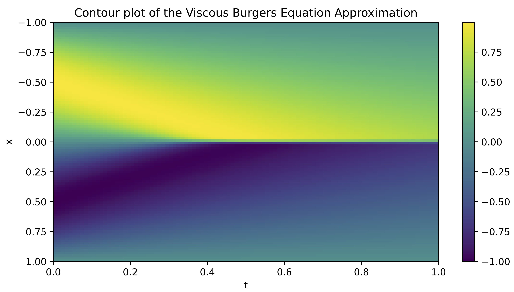
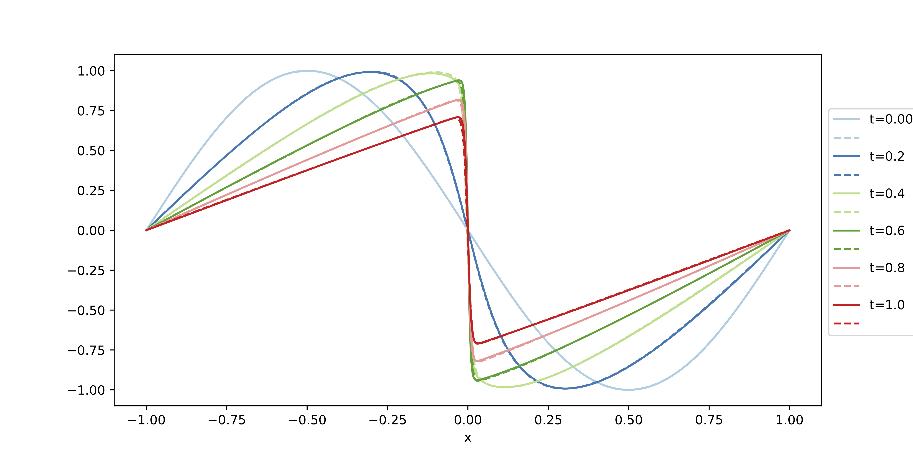
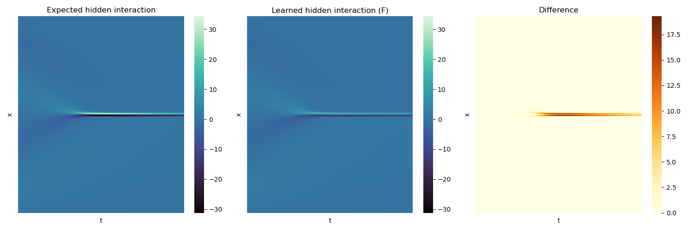

# UPINN for Burger's equation
Universal Physics Informed Neural Network [(UPINN)](https://proceedings.mlr.press/v202/podina23a.html) applied on Burger's Equation:

$$
\frac{\partial  u}{\partial t} = -u \frac{\partial u}{\partial x} + \nu \frac{\partial^2 u}{\partial x^2}, \quad \nu=\frac{1}{100 \pi}, \quad u(x,0)=-\sin(\pi x)
$$

where the differential operator $-u \frac{\partial u}{\partial x}$ is assumed to be unknown and is approximated by a Neural Network $F(\vec{u};\theta_F)$.

<figure>
  
  
  <figcaption>Approximated solution.</figcaption>
<figure>

<figure>
  
  <figcaption>Unknown interaction: expected, learned and difference.</figcaption>
<figure>

